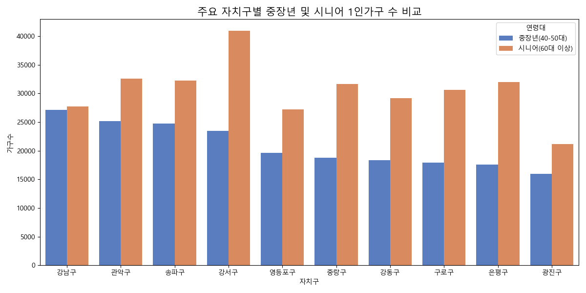
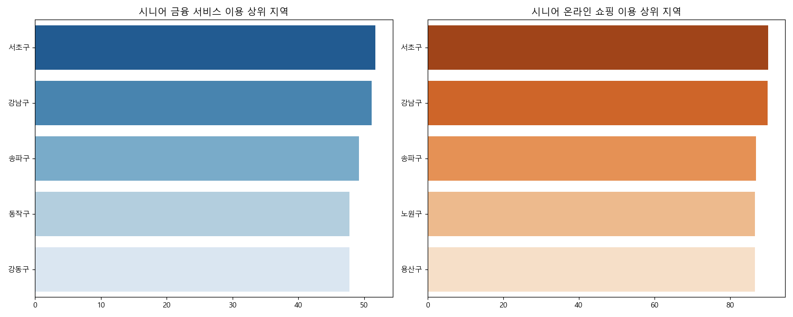
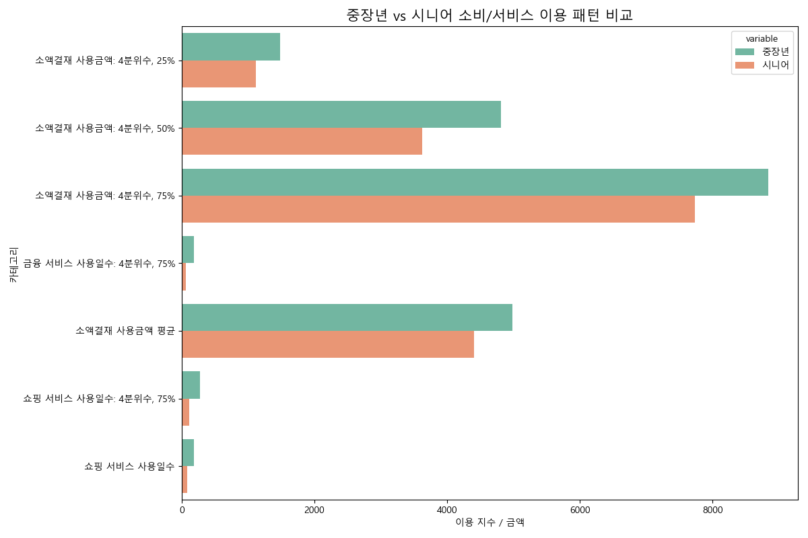

# 📊 서울시 1인가구 연령대별 소비 패턴 종합 분석 보고서

서울시 1인가구를 청년층(20-30대), 중장년층(40-50대), 시니어층(60대 이상)으로 구분하여 지역별 분포와 소비 특성을 분석한 결과입니다.

---

## 1. 연령대별 지역 분포 및 밀집도 비교

연령대에 따라 1인가구가 밀집된 지역은 뚜렷한 차이를 보입니다. 청년층은 관악구에 집중된 반면, 시니어층은 강서구, 노원구 등 외곽 주거 지역 비중이 높습니다.

| 연령대 | 주요 밀집 지역 (Top 3) | 특이사항 |
| :--- | :--- | :--- |
| **청년층 (20-30대)** | 관악구, 강서구, 강남구 | 대학가 및 역세권 오피스텔 밀집 지역 선호 |
| **중장년층 (40-50대)** | **강남구**, 관악구, 송파구 | 경제 활동의 중심지 및 직주 근접 선호 |
| **시니어층 (60대 이상)** | **강서구**, 노원구, 관악구 | 대단지 아파트 및 노후 주거지가 형성된 외곽 지역 |

---

## 2. 중장년 및 시니어층의 소비 특성 분석

### 🛍️ 소비 서비스 이용 지표
시니어층의 경우 단순 인구수와 관계없이 **경제적 여력이 높은 지역**에서 온라인 서비스 이용이 매우 활발하게 나타났습니다.

- **금융 서비스:** **서초구, 강남구, 송파구** 순으로 시니어층의 이용률이 높습니다. 자산 관리 및 비대면 금융 활동에 적극적인 '액티브 시니어'가 강남 3구에 밀집해 있음을 시사합니다.
*   **온라인 쇼핑:** 금융 서비스와 마찬가지로 **서초구, 강남구, 송파구** 지역 시니어들의 이용 지수가 가장 높게 측정되었습니다.
- **배달 서비스:** 시니어층의 배달 이용은 청년층의 약 50% 수준으로 낮으나, **중구, 노원구, 용산구** 지역에서 상대적으로 높게 나타났습니다.

---

## 3. 연령대별 소비 카테고리 비교

연령대가 높아질수록 디지털 소비(배달, OTT 등)의 비중은 낮아지지만, 온라인 쇼핑과 금융 서비스의 비중은 유지되거나 특정 지역에서 더 높게 나타나는 경향을 보입니다.

### 💡 연령대별 주요 소비 항목
1. **중장년층 (40-50대):** 
    - 전 연령대 중 **소액결제 규모가 가장 큼**.
    - 쇼핑 서비스 이용일수가 매우 높으며(노원, 도봉 지역), 온라인을 통한 생필품 구매가 정착된 세대입니다.
2. **시니어층 (60대 이상):**
    - **금융 및 정보 검색** 비중이 상대적으로 높음.
    - 온라인 쇼핑과 배달 이용은 지역별 소득 수준에 따라 양극화가 뚜렷하게 나타남.
    - 디지털 기기 활용이 능숙한 강남권 시니어와 전통적 소비를 선호하는 취약 계층이 공존합니다.

---

## 💡 종합 결론 및 시사점

- **타겟 마케팅:** 1인가구 대상 비즈니스 시, **청년층은 관악/영등포**의 배달·여가 중심, **중장년층은 강남/강서**의 쇼핑·실속형 소비, **시니어층은 강남 3구**의 금융·프리미엄 쇼핑을 타겟으로 하는 것이 효율적입니다.
- **지역적 특성:** **강북구, 강서구, 도봉구** 등은 전 연령대에 걸쳐 1인당 소비 활동성 지수가 높게 나타나는 '핵심 소비 지역'으로 분석됩니다.
- **디지털 격차:** 시니어층 내에서도 지역에 따른 디지털 서비스(금융, 쇼핑) 이용률 격차가 매우 크므로, 이에 대한 세밀한 접근이 필요합니다.
