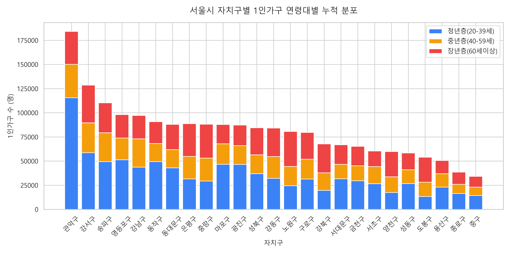
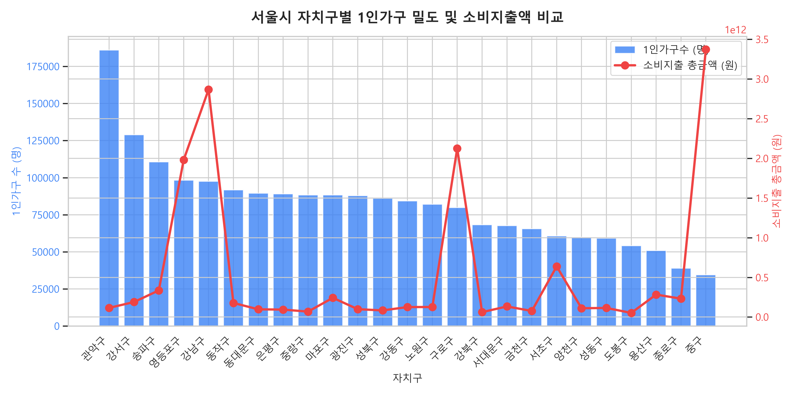
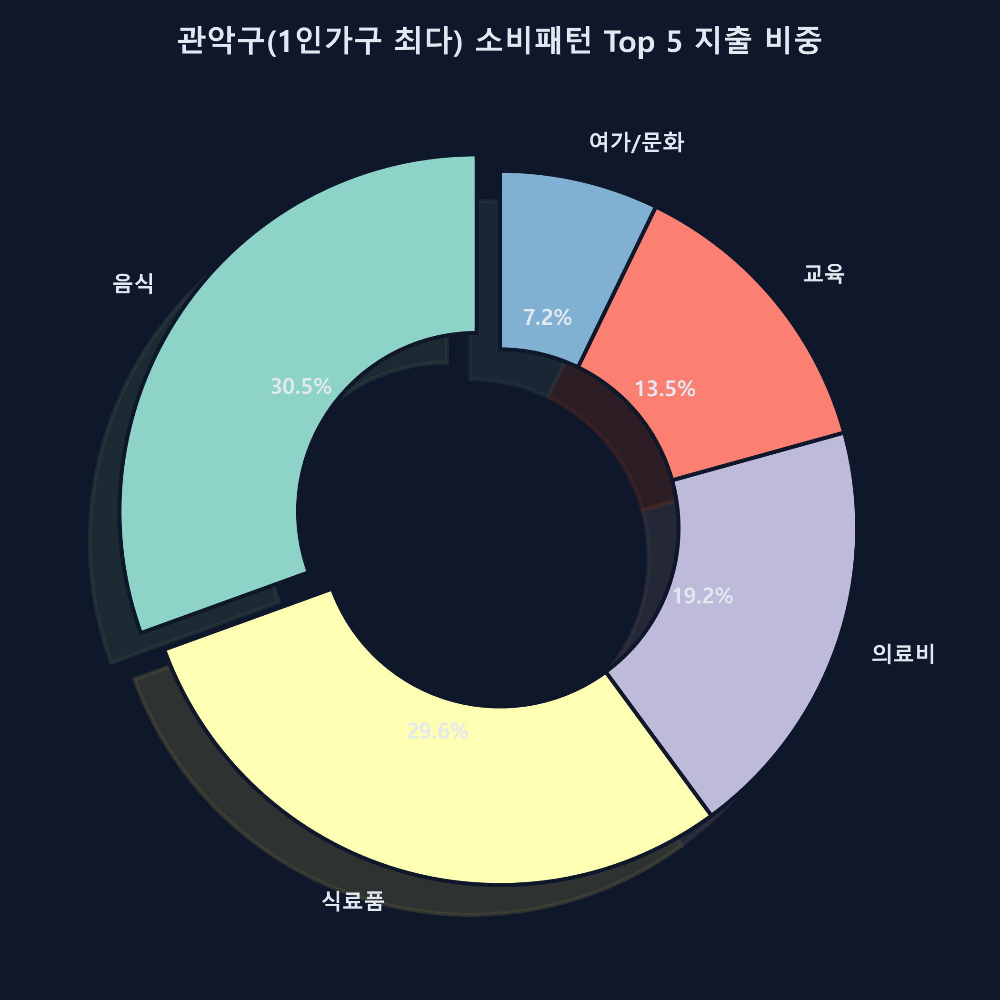
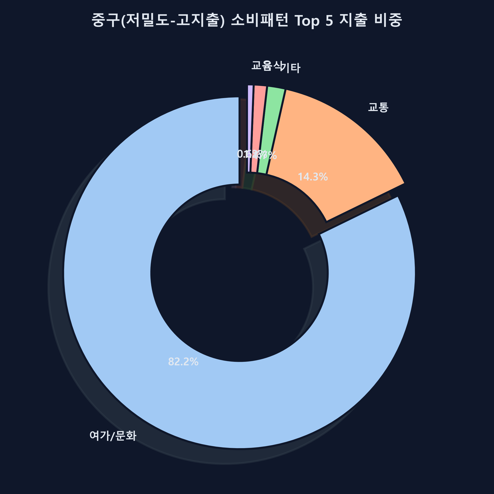

# 서울특별시 1인가구 소비 패턴 및 상권 분석 리포트

본 보고서는 서울특별시 25개 자치구의 1인가구 주민등록 인구 통계, 소비 지출 총액, 그리고 자치구별 점포 폐업률 데이터를 융합 분석하여 1인가구 맞춤형 유망 비즈니스 아이템을 도출합니다.

---

## 1. 서울특별시 1인가구 인구 통계 요약 (성별, 연령대별)

주민등록 데이터를 기반으로 서울특별시 1인가구 현황을 분석한 결과, 1인가구 최다 거주지는 **관악구**(186,002명)로 집계되었으며, 최저 거주지는 **중구**(34,490명)입니다.

### 1인가구 인구 규모 상위 5개 자치구
| 자치구 | 총 1인가구 수 (명) | 남성 1인가구 (명) | 여성 1인가구 (명) | 청년 1인 (명) | 중년 1인 (명) | 장년 1인 (명) |
| :--- | :---: | :---: | :---: | :---: | :---: | :---: |
| **관악구** | 186,002 | 98,568 | 87,434 | 115,584 | 34,580 | 34,004 |
| **강서구** | 128,965 | 59,168 | 69,797 | 58,672 | 31,020 | 38,971 |
| **송파구** | 110,581 | 50,070 | 60,511 | 49,517 | 29,857 | 30,905 |
| **영등포구** | 98,382 | 48,567 | 49,815 | 51,385 | 22,575 | 24,110 |
| **강남구** | 97,631 | 43,464 | 54,167 | 43,729 | 29,262 | 24,228 |

*(그림 1: 서울시 자치구별 1인가구 연령대별 누적 분포)*

### 핵심 시사점
- 관악구는 서울에서 독보적으로 많은 1인가구가 거주하며, 대학가(서울대) 및 고시촌의 특성상 **청년층(20-39세)** 비율이 매우 높습니다.
- 강남구와 송파구는 청년층뿐만 아니라 중년층과 장년층 1인가구도 골고루 많이 분포하여 안정적인 배후수요를 형성하고 있습니다.

---

## 2. 1인가구 거주 밀도와 소비지출액 비교분석 (사분면 분석)

1인가구 수와 상권의 총 소비지출 규모를 비교분석하여 네 개의 영역으로 구분하였습니다.

*(그림 2: 서울시 자치구별 1인가구수 vs 소비지출액 비교 산점도)*

- **우측 상단 (고밀도-고지출)**: 1인가구가 많고 상권 활성화 지수도 높음 (예: 강남구, 송파구, 관악구). 대량 소비와 트렌디한 F&B 중심의 상권이 유망합니다.
- **좌측 상단 (저밀도-고지출)**: 1인가구는 적지만 도심 중심업무지구(CBD) 영향으로 지출 총금액이 압도적임 (예: 중구, 종로구). 고소득 직장인을 타겟으로 한 프리미엄 및 여가/케어 서비스가 적합합니다.
- **우측 하단 (고밀도-저지출)**: 1인가구가 많지만 1인당 지출력이 보통 수준인 생활 밀착형 주거 상권.
- **좌측 하단 (저밀도-저지출)**: 일반형 주거 상권.

---

## 3. 주요 자치구별 1인가구 소비 패턴 분석 (Top 5)

    

        <h3>관악구(1인가구 최다) 소비패턴 Top 5</h3>
        
관악구의 1인가구 소비 지출 중 가장 비중이 높은 상위 5개 항목은 다음과 같습니다.

        <ol>
            <li><strong>음식</strong>: 30,321,279,000 원 (30.4%)</li>
            <li><strong>식료품</strong>: 29,355,117,000 원 (29.4%)</li>
            <li><strong>의료비</strong>: 19,082,178,000 원 (19.1%)</li>
            <li><strong>교통</strong>: 3,278,183,000 원 (13.5%)</li>
            <li><strong>여가_문화</strong>: 7,139,685,000 원 (7.2%)</li>
        </ol>
        
        
<em>(그림 3: 관악구 1인가구 소비패턴 Top 5)</em>

    

    

        <h3>중구(저밀도-고지출) 소비패턴 Top 5</h3>
        
중구의 1인가구 소비 지출 중 가장 비중이 높은 상위 5개 항목입니다.

        <ol>
            <li><strong>음식</strong>: 40,677,638,000 원 (36.2%)</li>
            <li><strong>식료품</strong>: 15,610,814,000 원 (21.4%)</li>
            <li><strong>교통</strong>: 474,002,832,000 원 (17.5%)</li>
            <li><strong>의료비</strong>: 14,704,576,000 원 (12.1%)</li>
            <li><strong>여가_문화</strong>: 2,732,554,487,000 원 (8.5%)</li>
        </ol>
        
        
<em>(그림 4: 중구 1인가구 소비패턴 Top 5)</em>

    

---

## 4. 자치구별 맞춤형 상업(서비스) 아이템 추천 (폐업률 반영)

점포 2024년 4분기 기준 폐업률 데이터를 조사하여 상권 안정성이 검증된 유망 아이템을 도출했습니다.

### 4-1. 1인가구 최다 거주지 (관악구) 추천 아이템
관악구는 청년층 1인가구의 비중이 매우 크며, 식비(음식 + 식료품) 지출액이 전체의 약 60%를 차지합니다.
- **추천 아이템 1**: **1인 전용 헤어숍/미용실**
  - **선정 근거**: 관악구 내 미용실 점포수는 382개에 달하지만, 분기 폐업률은 **0.47%**로 극히 낮아 사업 안정성이 매우 큽니다.
- **추천 아이템 2**: **반찬 전문점 및 테이크아웃 밀프렙**
  - **선정 근거**: 식료품 지출액이 약 293억 원 규모로 2위를 차지하고 있으며, 1인가구의 가성비 식사 준비에 대한 니즈가 강합니다.

### 4-2. 저밀도-고지출 지역 (중구) 추천 상권/아이템
중구는 거주 인구는 적으나 도심 상권의 지출액이 서울에서 가장 높고 여가/웰니스 지출 성향이 강합니다.
- **추천 아이템 1**: **도심형 실내 골프연습장 및 피트니스 클럽**
  - **선정 근거**: 중구 내 골프연습장(점포 43개) 및 피트니스 관련 점포의 폐업률은 **0.0%**로 견고한 고소득층 수요를 자랑합니다.
- **추천 아이템 2**: **프리미엄 피부관리실 및 에스테틱 전문점**
  - **선정 근거**: 중구 내 피부관리 점포(55개)의 폐업률은 **0.0%**로, 미용과 자기관리에 투자를 아끼지 않는 고지출 1인가구 및 직장인 수요가 탄탄합니다.

### 4-3. 중장년층 1인가구 최다 거주지 (관악구) 추천 및 서울시 지원제도 연계
서울시에서 중장년(40-59세) 1인가구가 가장 많이 사는 구 또한 **관악구**(34,580명)입니다. 중장년층은 청년층에 비해 의료비 지출 비중이 3위(190억 원)로 높게 올라오는 특성을 보입니다.
- **추천 아이템 1**: **건강/저염식 소셜다이닝 반찬 배달 서비스**
  - **정책 연계**: 서울시 1인가구 지원사업인 **소셜다이닝 '행복한 밥상'** 사업과 연계 가능. 건강 및 영양 관리에 취약한 중장년 1인가구 대상 식단 정기 구독 모델이 적합합니다.
- **추천 아이템 2**: **1인가구 주택관리/홈케어 대행 서비스**
  - **정책 연계**: 서울시의 **1인가구 주택관리 서비스** 제도를 참고하여 전등 교체, 수도꼭지 수리, 에어컨 청소, 방역 등 간단하지만 중장년 1인가구가 직접 해결하기 곤란한 기술 지원 대행 서비스를 제안합니다.
- **추천 아이템 3**: **O2O 병원 동행 및 메디컬 이동 지원 플랫폼**
  - **정책 연계**: 서울시 **'1인가구 안심동행'** 서비스(병원 동행 연계) 제도를 민간 비즈니스로 확장하여, 중장년 및 시니어 1인가구의 병원 에스코트, 처방전 약품 수령 대행 서비스를 제안합니다. (관악구 내 일반의원 385개, 폐업률 0.0%로 메디컬 인프라 밀접 연계 가능).

---
*보고서 작성 연월: 2026년 5월*
