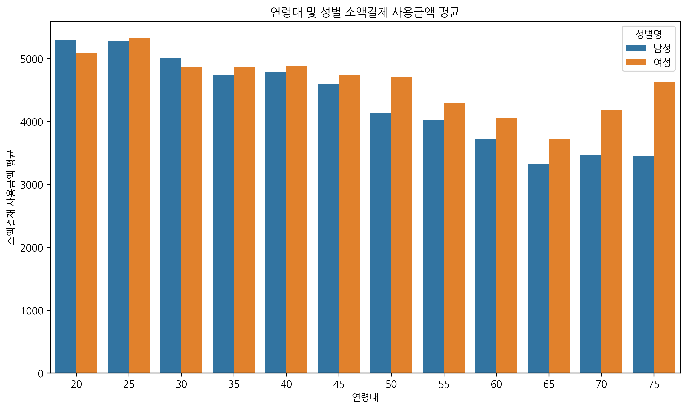
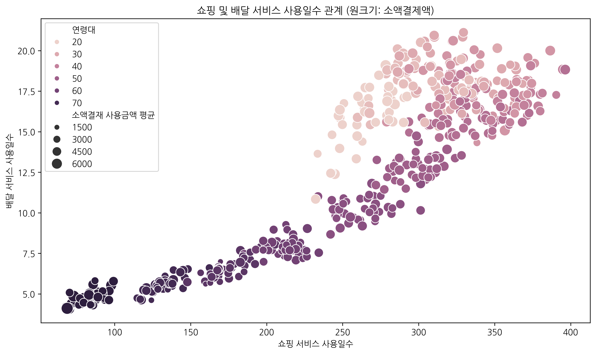
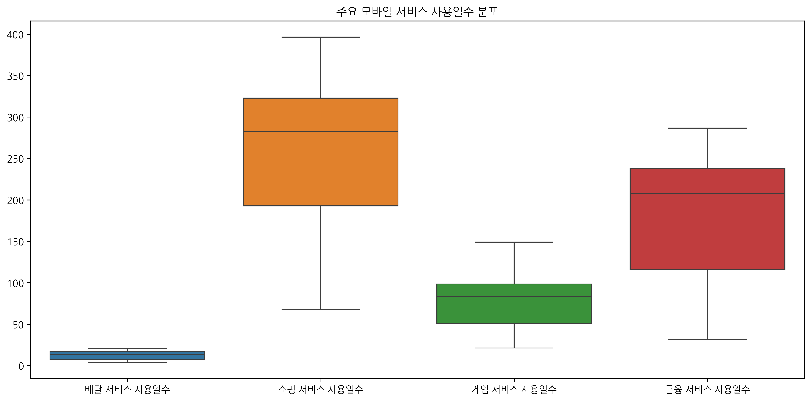
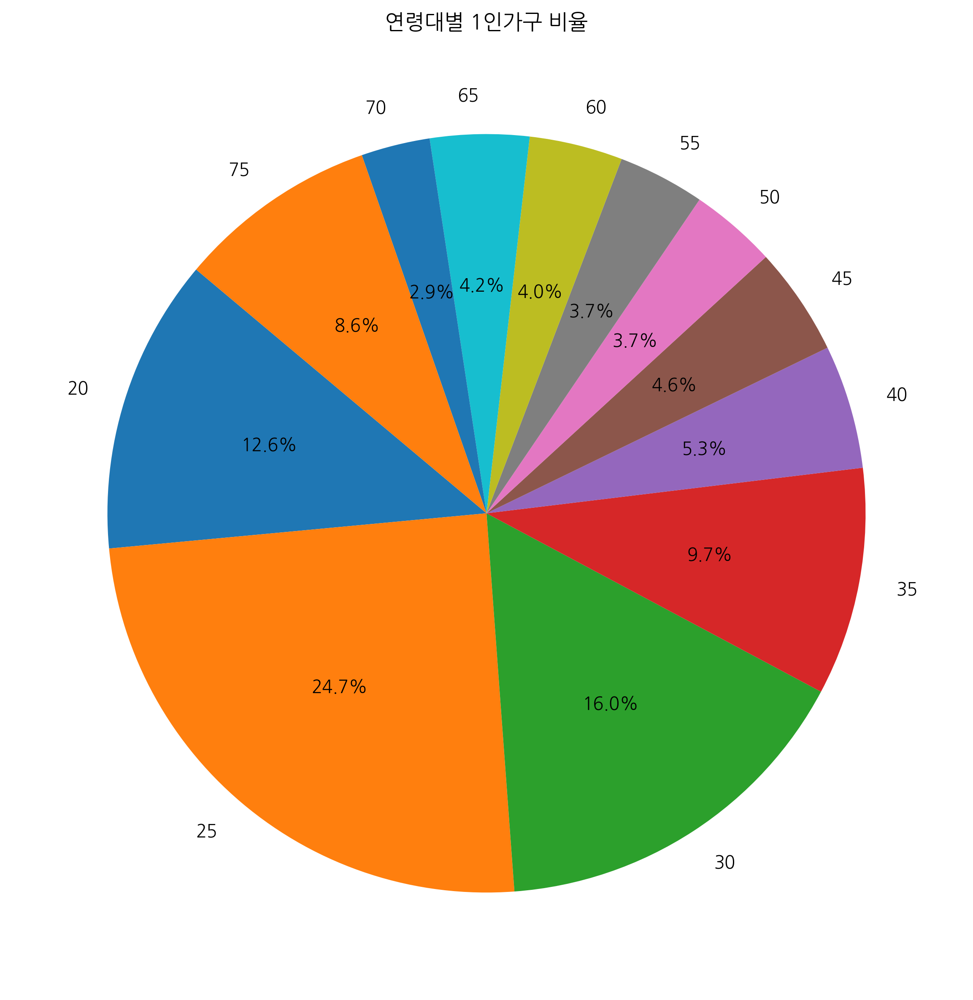
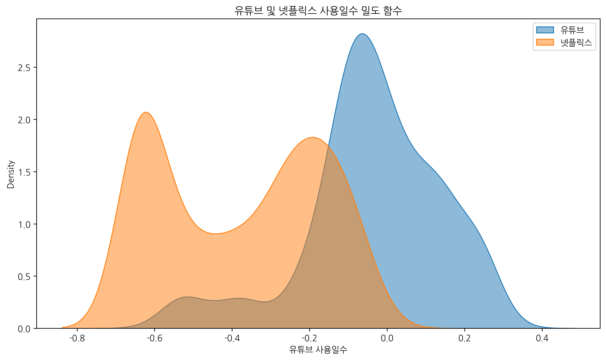
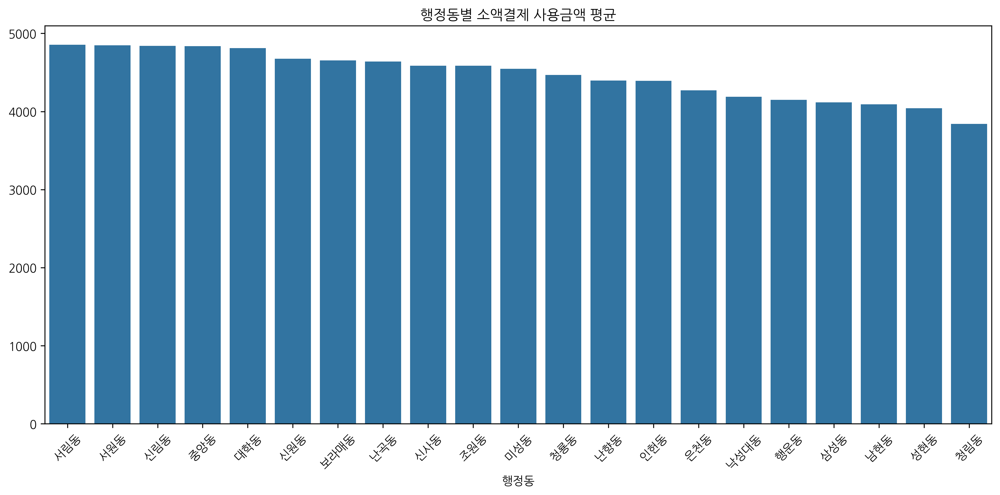
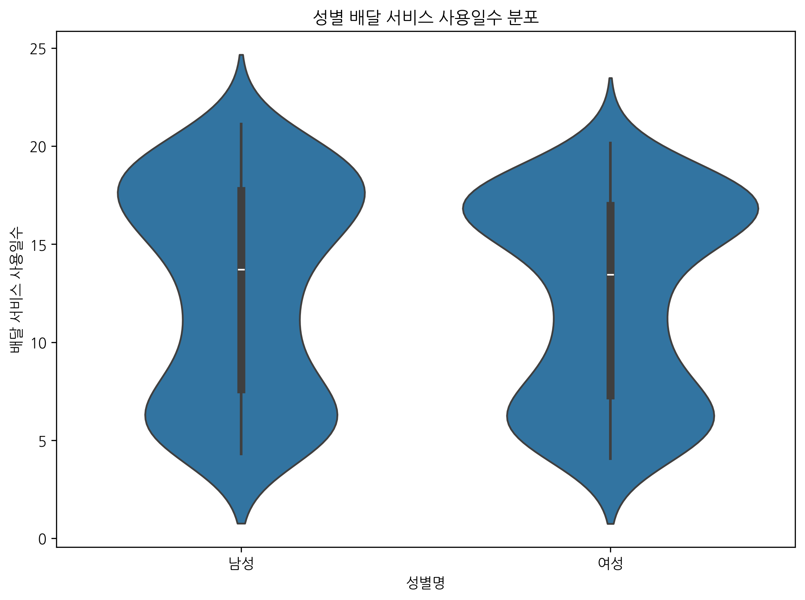
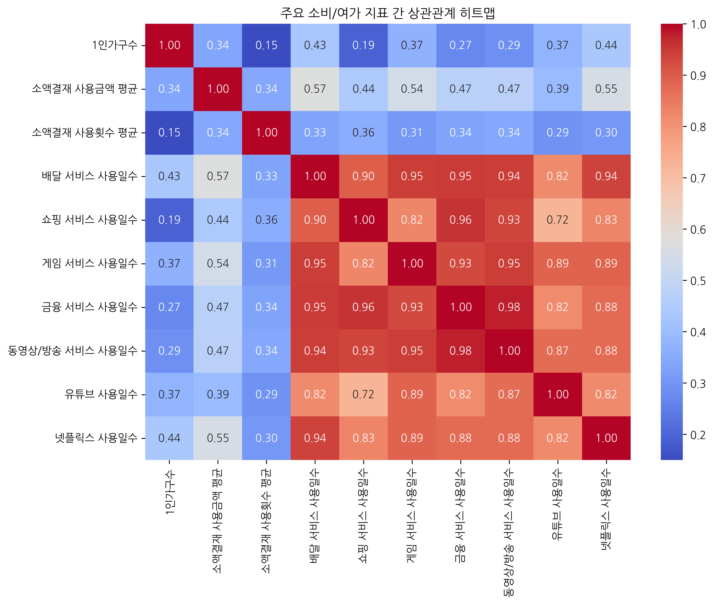
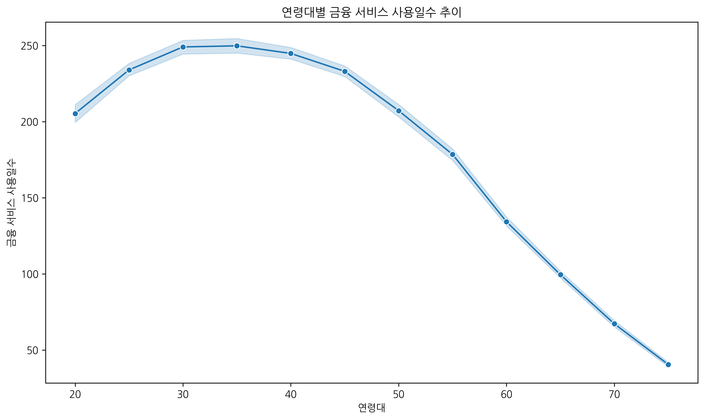
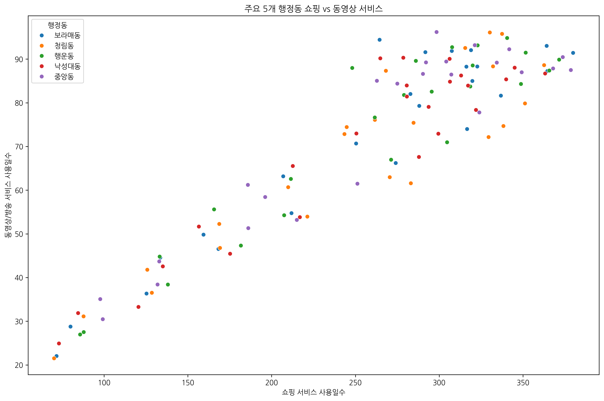

# 관악구 1인가구 소비패턴 EDA 리포트

## 1. 개요
- **목적**: 1인가구 최다 거주 자치구인 **관악구**의 2025년 최신 통신 데이터를 분석하여 소비 및 여가 패턴을 파악합니다.
- **분석 데이터**: 2025년 12월 29개 통신정보 데이터
- **데이터 크기**: 504행, 14열

## 2. 데이터 기본 정보 및 기술 통계

### 수치형 변수 기술 통계
|       |   1인가구수 |   소액결재 사용금액 평균 |   소액결재 사용횟수 평균 |   배달 서비스 사용일수 |   쇼핑 서비스 사용일수 |   게임 서비스 사용일수 |   금융 서비스 사용일수 |   동영상/방송 서비스 사용일수 |   유튜브 사용일수 |   넷플릭스 사용일수 |
|:------|--------:|---------------:|---------------:|--------------:|--------------:|--------------:|--------------:|------------------:|-----------:|------------:|
| count |  504    |         504    |         504    |        504    |        504    |        504    |        504    |            504    |     504    |      504    |
| mean  |  293.22 |        4468.42 |           2.41 |         12.59 |        257.03 |         76.61 |        178.57 |             71.63 |      -0.04 |       -0.38 |
| std   |  344.28 |         921.19 |           0.72 |          5.19 |         86.08 |         30.29 |         72.89 |             21.66 |       0.18 |        0.21 |
| min   |   30.32 |         583.33 |           0    |          4.07 |         68    |         21.39 |         31.25 |             21.51 |      -0.6  |       -0.66 |
| 25%   |  113.8  |        3879.18 |           2.33 |          7.36 |        192.79 |         50.94 |        116.33 |             55.44 |      -0.11 |       -0.61 |
| 50%   |  164.27 |        4566.64 |           2.55 |         13.52 |        282.17 |         83.52 |        207.29 |             80.76 |      -0.04 |       -0.36 |
| 75%   |  310.79 |        5075.99 |           2.78 |         17.28 |        322.7  |         98.5  |        238.04 |             88.93 |       0.09 |       -0.19 |
| max   | 2462.7  |        7333.33 |           3.33 |         21.12 |        396.39 |        149.03 |        286.69 |            100.21 |       0.33 |       -0.01 |

**[기술통계 요약 및 시사점]**
관악구 지역의 통신 및 소비 지표를 분석한 결과, 전반적으로 1인가구의 모바일 기반 소비가 활발하게 나타남을 알 수 있습니다. 소액결제 사용금액의 평균은 약 4468원이며, 최대 7333원까지 소비하는 집단도 확인됩니다. 또한 배달 및 쇼핑 서비스 사용일수는 각각 평균 12.6일, 257.0일로 나타나, 일상 생활에서 온라인 커머스와 배달 플랫폼의 의존도가 높음을 시사합니다. 게임 및 영상 매체 소비 측면에서도 유튜브와 넷플릭스 등의 사용이 지속적으로 이루어지고 있습니다. 전체적으로 이 지역 1인가구는 디지털 환경에 매우 친숙하며, 비대면 소비 패턴이 고착화되어 있음을 기술통계를 통해 확인할 수 있습니다.

## 3. 소비패턴 심층 시각화 분석

### 연령대 및 성별 소액결제 사용금액 평균

**[분석 결과]**: 연령대별 소액결제 금액을 성별로 비교한 막대 그래프입니다. 특정 연령대에서 소액결제가 두드러지게 높게 나타나며, 전반적으로 모바일 소액결제가 활성화된 연령층을 확인할 수 있습니다. 청년층의 모바일 콘텐츠 및 쇼핑 결제 의존도가 상대적으로 높음을 시사합니다.

### 쇼핑과 배달 서비스 사용일수 산점도

**[분석 결과]**: 쇼핑 서비스 사용일수와 배달 서비스 사용일수 간의 양의 상관관계가 관찰됩니다. 이는 온라인 쇼핑을 자주 하는 1인가구일수록 배달 서비스 또한 적극적으로 활용하는 '비대면 소비 친화적' 성향을 가짐을 의미합니다.

### 주요 모바일 서비스 사용일수 분포

**[분석 결과]**: 여러 모바일 서비스들의 사용일수 분포를 보여주는 박스플롯입니다. 금융 및 쇼핑 서비스의 중앙값이 비교적 높게 형성되어 있어, 해당 서비스들이 1인가구의 일상에서 매우 빈번하게 사용되고 있음을 알 수 있습니다.

### 연령대별 1인가구 비율

**[분석 결과]**: 해당 자치구 내 1인가구의 연령대별 분포를 보여주는 파이 차트입니다. 특정 연령대에 인구가 집중되어 있는 구조를 확인할 수 있으며, 이는 자치구의 주거 환경(대학가, 오피스 밀집 지역 등)이 특정 세대에게 매력적임을 보여줍니다.

### 유튜브 및 넷플릭스 사용 밀도 함수

**[분석 결과]**: 유튜브와 넷플릭스 사용일수의 분포를 나타냅니다. 유튜브 사용일수는 전반적으로 높게 넓게 분포하는 반면, 넷플릭스는 특정 구간에 집중되어 있는 특징을 보이며, 두 플랫폼 간의 소비 패턴 차이를 잘 보여줍니다.

### 행정동별 소액결제 사용금액 평균

**[분석 결과]**: 자치구 내 세부 행정동별로 소액결제 사용금액을 비교한 그래프입니다. 특정 행정동에서 유독 소비 규모가 큰 것으로 나타나며, 이는 상권 접근성이나 거주민의 소득 수준 차이에서 기인할 수 있습니다.

### 성별 배달 서비스 사용일수 (바이올린 플롯)

**[분석 결과]**: 성별에 따른 배달 서비스 이용일수 차이를 입체적으로 보여줍니다. 남성과 여성 집단 간의 배달 앱 활용 빈도의 분포 차이를 통해 타겟팅된 마케팅 전략 수립이 가능함을 시사합니다.

### 주요 지표 상관관계 히트맵

**[분석 결과]**: 분석에 사용된 다양한 수치형 변수들 간의 상관관계를 보여주는 히트맵입니다. 소액결제와 쇼핑, 쇼핑과 금융 서비스 등 특정 변수 묶음 간에 강한 상관성이 도출되어, 디지털 라이프스타일 지표가 상호 연관되어 움직임을 증명합니다.

### 연령대별 금융 서비스 사용일수

**[분석 결과]**: 연령대가 증가함에 따라 모바일 금융 서비스의 사용일수가 어떻게 변화하는지 보여주는 선 그래프입니다. 청년층부터 중장년층까지 모바일 뱅킹 및 간편결제 서비스의 침투율을 확인할 수 있는 중요한 지표입니다.

### 주요 행정동 쇼핑 및 동영상 서비스 산점도

**[분석 결과]**: 가장 인구가 많은 5개 행정동을 대상으로 쇼핑과 동영상 서비스 이용의 군집 특성을 파악한 산점도입니다. 행정동마다 주거하는 1인가구의 성향(영상 미디어 소비 위주인지, 쇼핑 위주인지)이 미세하게 다름을 파악할 수 있습니다.