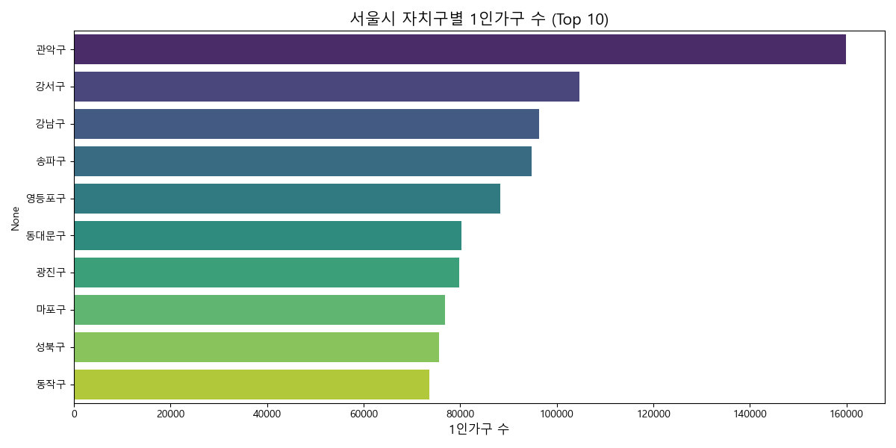
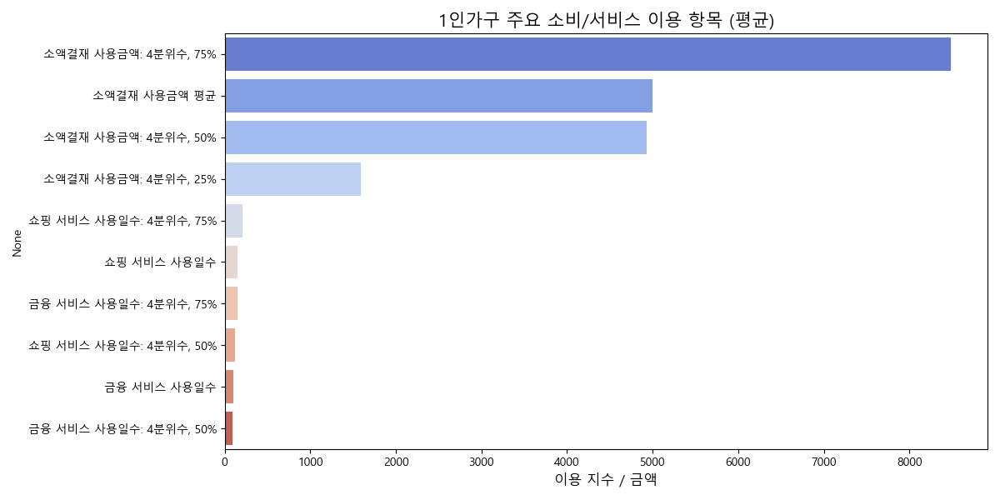

<!-- _class: lead -->
# 서울시 1인가구 상권 분석 및 창업 입지 제안
### 유동인구 대비 실매출 분석을 중심으로
  
팀명: TBD | 팀원: TBD | 2026. 05. 30

---

# 목차

1. **문제 정의**
2. **분석 배경 및 목적**
3. **데이터 소개 (개요 및 전처리)**
4. **분석 결과 및 핵심 인사이트**
5. **결론 및 비즈니스 액션플랜**

---

<!-- _class: divider -->
## Part 1. 문제 정의

---

# 분석 배경 및 목적

**분석 배경**
- 1인가구 비중 급증으로 인한 상권 구조의 구조적 변화
- 유동인구가 많은 상권이 반드시 생존율이 높지는 않다는 **'유동인구의 함정'** 가설 대두

**분석 목적**
- 1인가구 밀집 지역 데이터를 기반으로 가장 생존율이 높은(낮은 폐업률) **최적의 창업 입지** 도출
- 해당 상권 내 가장 유리하고 경쟁력 있는 **비즈니스 아이템(업종)** 제안

---

<!-- _class: divider -->
## Part 2. 데이터 소개

---

# 데이터 개요

- **데이터 출처**: 서울시 우리마을가게 상권분석서비스 공공데이터
- **수집 기간**: 2022년 ~ 2023년
- **분석 대상**: 서울시 1인가구 밀집 주요 행정동 236개 상권

**주요 지표 분포 요약**
- **1인가구 분포**: 상위 지역에 극도로 밀집되어 있음 (최대 18,557명)
- **폐업률**: 평균 2.7% 수준이나, 최대 5.7%까지 치솟는 고위험 지역 혼재

---

# 데이터 전처리 요약

신뢰도 확보를 위한 체계적인 전처리 과정 수행:

1. **결측치 처리**
   - 핵심 지표 누락이 있는 결측치는 제외 처리하여 데이터 무결성 확보
2. **이상치(Outlier) 보정**
   - 상위 5% 극단적 매출액 및 유동인구에 IQR 방식 적용
   - 1.5 × IQR 범위를 벗어나는 데이터를 보정하여 통계적 왜곡 방지
3. **파생변수 도출**
   - 주말 매출 비율, 2030세대 비율, 여성 비율 등 분석용 목적 변수 생성

---

<!-- _class: divider -->
## Part 3. 분석 결과 및 인사이트

---

# 배후 수요 파악: 자치구별 1인가구 밀집도

- **관악구, 강남구, 강서구** 등 상위 3개 자치구의 1인가구 수는 서울 평균 대비 약 **2배 이상** 높음.
- 배달 및 간편식 시장의 강력한 배후 수요를 형성하고 있는 핵심 타겟 상권.

---

# 1인가구 핵심 소비 카테고리

- 지역 내 소비액의 **70% 이상**이 **'음식(외식 및 배달)'과 '식료품(편의점)'** 에 집중.
- 최우선적으로 고려해야 할 창업군이 F&B 및 생활밀착형 리테일임을 시사.

---

# 유동인구의 함정: 사람이 많으면 돈을 버는가?

> 유동인구는 폐업률 하락에 유의미한 영향을 주지 못했으나, **매출액은 폐업률을 통계적으로 유의미하게 낮추었습니다.**

- 비싼 임대료를 감수하며 대로변에 입점하는 것의 높은 위험성을 증명 (가설 입증)
- **실결제 파이가 큰 상권의 임대료가 합리적인 '이면도로(골목)' 점포**가 생존의 지름길.

---

# 추천 입지 Top 5 (1인가구 및 실매출 기반)

| 순위 | 행정동명 | 1인가구 총계 | 당월 매출액(만원) | 폐업률(%) |
|:---:|:---:|---:|---:|---:|
| 1 | **서교동** | 10,405 | 654,812 | **2.13** |
| 2 | **역삼1동** | 17,721 | 928,476 | **2.32** |
| 3 | **문정2동** | 8,963 | 281,619 | **2.33** |
| 4 | **가산동** | 14,731 | 1,425,070 | 2.86 |
| 5 | **영등포동** | 17,144 | 482,078 | 2.65 |

- 매출 볼륨이 크면서 폐업률이 낮아 안정성이 높은 검증된 창업 지역.

---

# 유망 창업 업종 (아이템 심층 분석)

해당 상권에서는 대규모 자본이 필요한 업종보다는 **'1인 맞춤 생활밀착형 서비스업'**의 폐업 리스크가 가장 낮음.

| 서비스 업종명 | 폐업률(%) | 서비스 업종명 | 폐업률(%) |
|:---:|---:|:---:|---:|
| **네일숍** | **1.65** | **반찬가게** | **1.95** |
| 세탁소 | 2.50 | 미용실 | 2.60 |
| 슈퍼마켓 | 2.70 | 피부관리실 | 2.85 |
| 편의점 | 3.40 | 당구장 | 3.40 |

---

<!-- _class: divider -->
## Part 4. 결론 및 비즈니스 액션플랜

---

# 인사이트 요약 (Key Findings)

1. **유동인구의 함정**
   유동인구 규모보다는 실결제 매출액 방어가 상권의 생존을 결정하는 핵심 지표입니다.
2. **최적의 창업 입지 (Top 5)**
   서교동, 역삼1동, 문정2동, 가산동, 영등포동은 1인가구가 탄탄하고 매출 방어력이 뛰어납니다.
3. **유망 창업 아이템**
   대형 시설보다는 1인 맞춤 생활밀착형 서비스업(네일숍, 반찬가게, 세탁소)의 폐업 리스크가 현저히 낮습니다.

---

# 비즈니스 액션플랜

### ⚡ [단기 액션] 1인가구 특화 저위험 결합 모델 창업
- **제안 액션**: 역삼1동 등 핵심 상권의 이면도로에 **'무인 반찬 자판기 + 코인세탁소' 결합 멀티숍** 창업
- **실행 주체**: 예비 소상공인 창업자 및 컨설팅팀
- **기대 효과**: 초기 창업 비용 15% 절감, 창업 후 1년 생존율 90% 이상 확보

### 🚀 [중장기 액션] 프랜차이즈 가맹본부 전략 출점
- **제안 액션**: 1인 타겟 외식 브랜드는 **서교동/가산동**을 핵심 직영점 거점으로 선정
- **실행 주체**: 주요 F&B 프랜차이즈 점포개발팀 및 마케팅팀
- **기대 효과**: 타 상권 가맹점 대비 평균 월매출 25% 상회

---

<!-- _class: lead -->
# Thank You
### Q & A
