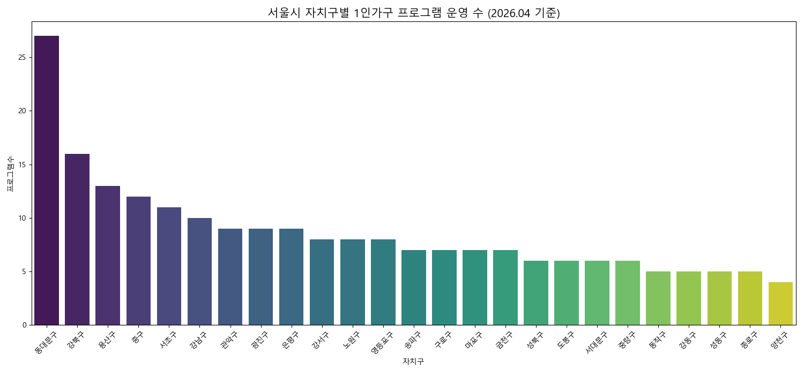
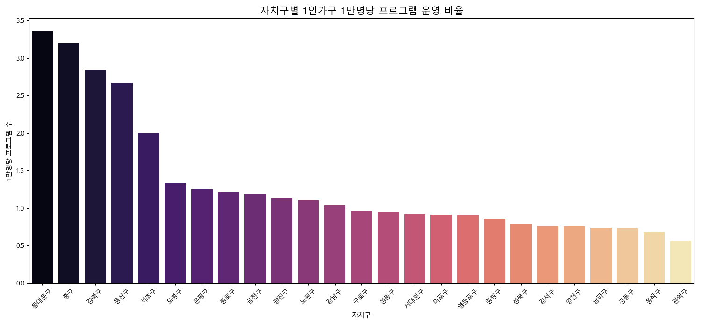
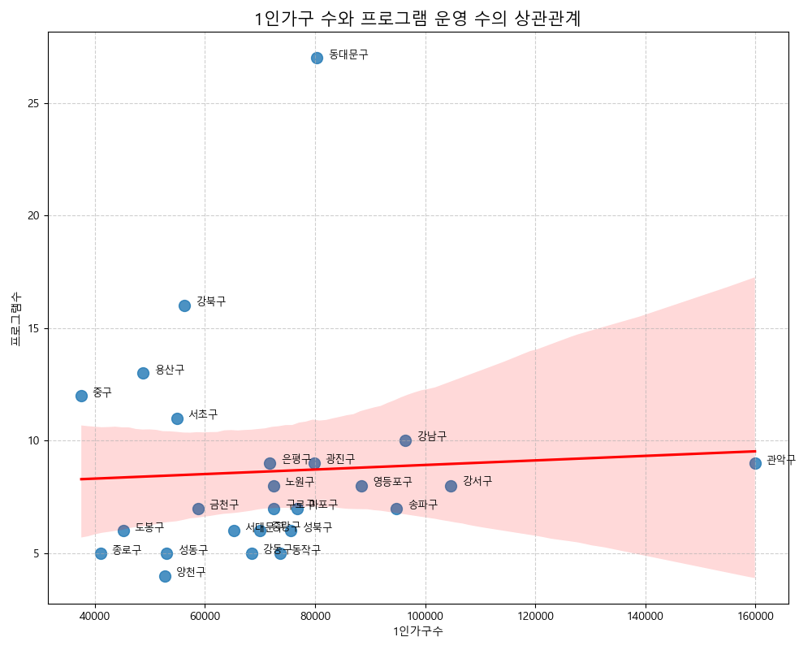

# 📈 서울시 자치구별 1인가구 지원사업 EDA 보고서

서울시 25개 자치구에서 운영 중인 1인가구 지원 프로그램 현황을 분석하여 지역별 서비스 공급 밀도와 특화 테마를 도출한 결과입니다.

---

## 1. 자치구별 프로그램 운영 현황 (활동성 분석)

2026년 상반기 기준, 자치구별 프로그램 운영 건수를 분석한 결과 **동대문구**가 가장 활발한 활동을 보이고 있습니다.

- **최상위 지역:** **동대문구(27건)**, 강북구(16건), 용산구(13건), 중구(12건).
- **특이사항:** 동대문구는 중장년층 대상의 클리닝 서비스 및 소모임 지원 등 타 자치구 대비 정기적이고 다양한 소규모 프로그램을 다수 운영하고 있습니다.

---

## 2. 1인가구 수 대비 서비스 공급 밀도 분석

단순 프로그램 수보다 중요한 것은 **실제 거주 인구 대비 서비스가 얼마나 충분히 공급되는가**입니다.

- **서비스 밀도 우수 지역:** **중구, 동대문구, 용산구, 강북구**. 
- **공급 부족 지역:** **관악구, 강서구, 강남구**. 이들 지역은 1인가구 절대 인구수는 매우 많으나, 인구 대비 운영되는 프로그램의 밀도는 서울시 평균 이하로 나타났습니다. 
    - *비즈니스 인사이트:* 관악구와 강남구는 정부 지원만으로는 해소되지 않는 거대한 민간 수요가 존재함을 의미합니다.

---

## 3. 자치구별 특화 사업 테마 분석

각 자치구는 지역의 지리적·인구적 특성에 따라 서로 다른 분야에 집중하고 있습니다.

| 자치구 | 주요 특화 테마 | 비즈니스 아이템 연계 방안 |
| :--- | :--- | :--- |
| **서초구/강남구** | 집수리(뚝딱이), 정리수납, 금융 | 프리미엄 가사 관리 및 자산관리 상담 서비스 |
| **동대문구/중구** | 중장년 소셜다이닝, 해충 방제 | 1인 가구 전용 방역 및 건강 식단 정기 배송 |
| **광진구** | 전용 아지트(휴식 공간) 운영 | 공유 거실, 워킹 스페이스 등 공간 비즈니스 |
| **강북구/용산구** | 관계망 형성, 취미 소모임 | 지역 기반의 유료 프리미엄 커뮤니티/클래스 |

---

## 4. 인구수와 서비스 공급의 상관관계

- **분석 결과:** 1인가구 인구수와 프로그램 운영 수 사이에는 **강한 상관관계가 나타나지 않았습니다.** 
- **결론:** 이는 정부 지원사업이 인구 비례보다는 자치구별 의지나 센터의 역량에 따라 차별적으로 이루어지고 있음을 보여줍니다. 따라서 **인구는 많으나 서비스 밀도가 낮은 '관악구', '강남구'** 등은 민간 서비스가 진입하여 독점적 우위를 점하기에 매우 유리한 시장입니다.

---

## 💡 최종 제언

1.  **동대문/중구 모델의 민간화:** 현재 호응이 좋은 '클리닝' 및 '소셜다이닝' 모델을 더 세분화하여 **'청년 전용 청소 구독'** 또는 **'프리미엄 밀키트 소모임'**으로 사업화할 수 있습니다.
2.  **관악/강남권의 서비스 공백 공략:** 정부 지원의 손길이 인구 대비 부족한 이 지역들을 타겟으로 **'토탈 라이프 케어'** 서비스를 런칭하는 것이 전략적으로 우수합니다.
3.  **전문 기술 교육의 사업화:** 서초/강남에서 진행하는 **'집수리 교육'**에 대한 높은 수요를 바탕으로, DIY 도구 렌탈과 교육이 결합된 온-오프라인 연계 모델을 추천합니다.
